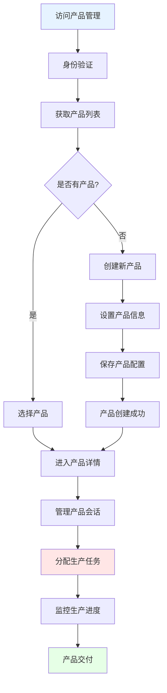
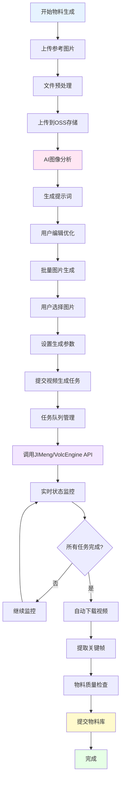
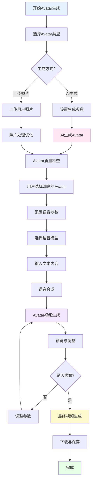
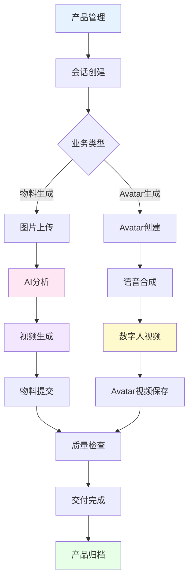

# AI物料生成平台 - 核心业务流程解决方案

## 项目概述

本项目是一个基于人工智能的物料生产平台，通过人机协作方式实现高效的视频内容创作。平台包含三条核心业务线：**Product管理**、**物料生成**和**Avatar生成**，为用户提供从项目管理到视频制作的完整解决方案。

## 核心业务架构

```
┌─────────────────────────────────────────────────────────────┐
│                    AI物料生成平台                            │
├─────────────────────────────────────────────────────────────┤
│  核心业务流程                                               │
│  ├─ Product管理 - 产品项目生命周期管理                      │
│  ├─ 物料生成 - AI驱动的视频物料生产                         │
│  └─ Avatar生成 - 数字人头像创建与视频制作                   │
├─────────────────────────────────────────────────────────────┤
│  技术支撑                                                   │
│  ├─ Next.js 15 + React 19 - 现代化前端框架                 │
│  ├─ Redis - 数据持久化与会话管理                           │
│  ├─ 阿里云OSS - 文件存储与CDN加速                          │
│  └─ AI服务集成 - GPT-4/JIMeng/HeyGen/VolcEngine           │
└─────────────────────────────────────────────────────────────┘
```

## 一、Product管理业务流程

### 1.1 业务概述
Product管理是平台的基础业务流程，负责产品项目的全生命周期管理，包括产品创建、会话管理、权限控制等核心功能。

### 1.2 核心流程图



### 1.3 关键功能模块

#### 1.3.1 产品认证与授权
```typescript
// 产品认证管理
class ProductAuthManager {
  // 获取认证头信息
  static getAuthHeaders(): Record<string, string> {
    return {
      'Content-Type': 'application/json',
      'Authorization': `Bearer ${process.env.PRODUCT_API_TOKEN}`,
      'X-Product-Key': process.env.PRODUCT_API_KEY
    };
  }
  
  // 验证产品访问权限
  static async validateProductAccess(productId: string): Promise<boolean> {
    // 验证用户是否有权限访问该产品
  }
}
```

#### 1.3.2 产品会话管理
```typescript
// 产品会话管理
class ProductSessionManager {
  // 创建产品会话
  static async createProductSession(
    productId: string, 
    sessionName: string
  ): Promise<SessionData> {
    // 在产品下创建新的工作会话
    // 关联产品ID进行权限控制
  }
  
  // 获取产品下的所有会话
  static async getProductSessions(productId: string): Promise<SessionMetadata[]> {
    // 获取指定产品的所有会话列表
  }
}
```

#### 1.3.3 产品生产监控
```typescript
// 产品生产监控
class ProductMonitor {
  // 监控产品生产状态
  static async monitorProductionStatus(productId: string): Promise<ProductionStatus> {
    // 统计产品下所有会话的生产进度
    // 包括物料生成和Avatar生成的状态
  }
  
  // 生产报告生成
  static async generateProductionReport(productId: string): Promise<ProductionReport> {
    // 生成详细的生产报告
  }
}
```

## 二、物料生成业务流程

### 2.1 业务概述
物料生成是平台的核心业务流程，通过AI技术将用户上传的图片转换为视频物料。整个流程包括图片上传、AI分析、提示词生成、视频制作和物料提交等环节。

### 2.2 完整业务流程图



### 2.3 详细技术实现

#### 2.3.1 图片上传与预处理
```typescript
// 图片上传处理
class ImageUploadProcessor {
  // 处理图片上传
  static async processImageUpload(file: File): Promise<ProcessedImage> {
    // 1. 文件格式验证
    if (!this.isValidImageFormat(file)) {
      throw new Error('不支持的图片格式');
    }
    
    // 2. 图片尺寸检测
    const dimensions = await this.detectImageDimensions(file);
    
    // 3. 上传到OSS
    const ossUrl = await this.uploadToOSS(file);
    
    // 4. 生成缩略图
    const thumbnail = await this.generateThumbnail(file);
    
    return {
      originalUrl: ossUrl,
      thumbnailUrl: thumbnail,
      dimensions,
      filename: file.name
    };
  }
}
```

#### 2.3.2 AI提示词生成
```typescript
// AI提示词生成服务
class AIPromptGenerator {
  // 生成视频提示词
  static async generateVideoPrompts(
    imageUrls: string[],
    userRequirement: string,
    projectStyle: string
  ): Promise<GeneratedPrompt[]> {
    
    const messages = [
      {
        role: "system",
        content: `你是一个专业的视频创作助手，擅长为AI视频生成工具创建高质量的提示词。
        项目风格：${projectStyle}
        用户需求：${userRequirement}`
      },
      {
        role: "user",
        content: [
          { type: "text", text: "请为这些图片生成适合视频制作的提示词" },
          ...imageUrls.map(url => ({ type: "image_url", image_url: { url } }))
        ]
      }
    ];
    
    const response = await openai.chat.completions.create({
      model: "gpt-4-vision-preview",
      messages,
      max_tokens: 2000
    });
    
    return this.parsePromptResponse(response.choices[0].message.content);
  }
}
```

#### 2.3.3 视频生成任务管理
```typescript
// 视频生成任务管理器
class VideoGenerationManager {
  // 批量提交视频生成任务
  static async submitBatchVideoTasks(
    images: ImageData[],
    prompt: string,
    options: VideoGenerationOptions
  ): Promise<VideoGenerationTask[]> {
    const tasks: VideoGenerationTask[] = [];
    
    // 并发处理所有图片
    const taskPromises = images.map(async (image, index) => {
      try {
        // 上传图片到OSS（如果是本地图片）
        const processedImageUrl = await this.ensureImageOnOSS(image);
        
        // 提交到视频生成服务
        const taskResult = await this.submitToVideoService(
          processedImageUrl,
          prompt,
          options
        );
        
        return {
          taskId: taskResult.taskId,
          imageIndex: index,
          imageName: image.filename,
          imageUrl: processedImageUrl,
          status: 'pending',
          createdAt: new Date().toISOString()
        };
      } catch (error) {
        return {
          taskId: null,
          imageIndex: index,
          imageName: image.filename,
          status: 'failed',
          error: error.message
        };
      }
    });
    
    const results = await Promise.all(taskPromises);
    return results;
  }
  
  // 监控视频生成状态
  static async monitorVideoTasks(taskIds: string[]): Promise<VideoTaskStatus[]> {
    const statusPromises = taskIds.map(async (taskId) => {
      const status = await this.checkVideoTaskStatus(taskId);
      return {
        taskId,
        status: status.status,
        progress: status.progress,
        videoUrl: status.videoUrl,
        error: status.error
      };
    });
    
    return await Promise.all(statusPromises);
  }
}
```

#### 2.3.4 物料提交系统
```typescript
// 物料提交服务
class MaterialSubmissionService {
  // 提交完成的视频物料
  static async submitVideoMaterial(
    videoTask: VideoGenerationTask,
    materialConfig: MaterialConfig
  ): Promise<SubmissionResult> {
    
    try {
      // 1. 预提交获取存储路径
      const preSubmitResult = await this.preSubmitMaterial({
        materialType: materialConfig.materialType,
        materialFileType: 1002, // MP4格式
        productId: materialConfig.productId,
        tags: materialConfig.tags
      });
      
      const { filePath, materialId } = preSubmitResult.data;
      
      // 2. 下载关键帧到服务器
      const keyframeFilePath = `${filePath}.jpg`;
      await this.downloadKeyframeToServer(videoTask.imageUrl, keyframeFilePath);
      
      // 3. 复制视频文件到指定路径
      await this.copyVideoToServerPath(videoTask.videoUrl, filePath);
      
      // 4. 更新物料状态为成功
      await this.updateMaterialStatus({
        materialId,
        dealStatus: 1, // 成功
        msg: '',
        keyframesUrl: this.generateRelativePath(keyframeFilePath)
      });
      
      return {
        success: true,
        materialId,
        filePath
      };
      
    } catch (error) {
      // 失败时报告错误状态
      await this.updateMaterialStatus({
        materialId,
        dealStatus: 2, // 失败
        msg: error.message
      });
      
      throw error;
    }
  }
}
```

## 三、Avatar生成业务流程

### 3.1 业务概述
Avatar生成是平台的特色业务流程，通过AI技术生成数字人头像，并结合语音合成技术制作数字人视频。支持多种数字人风格和语音选择。

### 3.2 Avatar生成流程图



### 3.3 详细技术实现

#### 3.3.1 Avatar图片生成
```typescript
// Avatar图片生成服务
class AvatarGenerationService {
  // AI生成Avatar
  static async generateAvatarImage(
    prompt: string,
    style: AvatarStyle,
    options: GenerationOptions
  ): Promise<GeneratedAvatar[]> {
    
    // 构建优化的提示词
    const optimizedPrompt = this.optimizeAvatarPrompt(prompt, style);
    
    // 调用图片生成API
    const response = await fetch('/api/generate-avatar-image', {
      method: 'POST',
      headers: { 'Content-Type': 'application/json' },
      body: JSON.stringify({
        prompt: optimizedPrompt,
        style: style,
        count: options.count || 4,
        resolution: options.resolution || '512x512'
      })
    });
    
    const result = await response.json();
    
    return result.avatars.map(avatar => ({
      id: avatar.id,
      url: avatar.url,
      prompt: optimizedPrompt,
      style: style,
      createdAt: new Date().toISOString()
    }));
  }
  
  // 上传照片生成Avatar
  static async createAvatarFromPhoto(
    photoFile: File,
    style: AvatarStyle
  ): Promise<ProcessedAvatar> {
    
    // 1. 照片预处理
    const processedPhoto = await this.preprocessPhoto(photoFile);
    
    // 2. 面部检测和优化
    const faceAnalysis = await this.analyzeFace(processedPhoto);
    
    // 3. 风格转换
    const styledAvatar = await this.applyAvatarStyle(processedPhoto, style);
    
    return {
      originalPhoto: processedPhoto,
      avatarImage: styledAvatar,
      faceAnalysis: faceAnalysis,
      style: style
    };
  }
}
```

#### 3.3.2 语音合成集成
```typescript
// 语音合成服务
class VoiceSynthesisService {
  // 获取可用语音列表
  static async getAvailableVoices(): Promise<VoiceOption[]> {
    // 集成VolcEngine语音合成服务
    const response = await fetch('/api/volcengine-list-voices');
    const data = await response.json();
    
    return data.voices.map(voice => ({
      voiceId: voice.voice_id,
      name: voice.name,
      gender: voice.gender,
      language: voice.language,
      style: voice.style,
      preview: voice.preview_url
    }));
  }
  
  // 文本转语音
  static async synthesizeVoice(
    text: string,
    voiceId: string,
    options: VoiceSynthesisOptions
  ): Promise<VoiceSynthesisResult> {
    
    const response = await fetch('/api/volcengine-generate-audio', {
      method: 'POST',
      headers: { 'Content-Type': 'application/json' },
      body: JSON.stringify({
        text: text,
        voice_id: voiceId,
        speed: options.speed || 1.0,
        pitch: options.pitch || 1.0,
        volume: options.volume || 1.0
      })
    });
    
    const result = await response.json();
    
    return {
      audioUrl: result.audio_url,
      duration: result.duration,
      text: text,
      voiceId: voiceId
    };
  }
}
```

#### 3.3.3 数字人视频生成
```typescript
// 数字人视频生成服务
class DigitalHumanVideoService {
  // 生成数字人视频
  static async generateDigitalHumanVideo(
    avatarImageUrl: string,
    audioUrl: string,
    options: VideoGenerationOptions
  ): Promise<VideoGenerationResult> {
    
    try {
      // 1. 准备HeyGen API请求
      const videoRequest = {
        title: options.title || 'Digital Human Video',
        video_inputs: [
          {
            character: {
              type: 'talking_photo',
              talking_photo_id: await this.uploadToHeyGen(avatarImageUrl),
              scale: options.scale || 1.0,
              offset: { x: 0.0, y: 0.0 },
              talking_style: options.talkingStyle || 'stable',
              expression: options.expression || 'default'
            },
            voice: {
              type: 'audio',
              audio_url: audioUrl
            },
            background: {
              type: 'color',
              value: options.backgroundColor || '#f6f6fc'
            }
          }
        ],
        dimension: {
          width: options.width || 1280,
          height: options.height || 720
        }
      };
      
      // 2. 提交视频生成任务
      const response = await fetch('https://api.heygen.com/v2/video/generate', {
        method: 'POST',
        headers: {
          'Content-Type': 'application/json',
          'X-Api-Key': process.env.HEYGEN_API_KEY,
        },
        body: JSON.stringify(videoRequest)
      });
      
      const result = await response.json();
      
      if (!response.ok) {
        throw new Error(`HeyGen API Error: ${result.message}`);
      }
      
      return {
        videoId: result.video_id,
        status: 'processing',
        estimatedTime: result.estimated_time,
        createdAt: new Date().toISOString()
      };
      
    } catch (error) {
      console.error('数字人视频生成失败:', error);
      throw error;
    }
  }
  
  // 监控视频生成状态
  static async checkVideoStatus(videoId: string): Promise<VideoStatus> {
    const response = await fetch(`https://api.heygen.com/v1/video_status.get?video_id=${videoId}`, {
      headers: {
        'X-Api-Key': process.env.HEYGEN_API_KEY,
      }
    });
    
    const result = await response.json();
    
    return {
      videoId: videoId,
      status: result.status,
      progress: result.progress,
      videoUrl: result.video_url,
      error: result.error,
      updatedAt: new Date().toISOString()
    };
  }
}
```

## 四、核心业务流程整合

### 4.1 统一的业务流程管理
```typescript
// 业务流程协调器
class BusinessFlowCoordinator {
  // 统一的任务调度
  static async coordinateProductionFlow(
    productId: string,
    flowType: 'material' | 'avatar',
    config: FlowConfig
  ): Promise<ProductionFlowResult> {
    
    try {
      // 1. 验证产品权限
      await ProductAuthManager.validateProductAccess(productId);
      
      // 2. 创建生产会话
      const session = await ProductSessionManager.createProductSession(
        productId,
        `${flowType}-${Date.now()}`
      );
      
      // 3. 根据流程类型执行不同的业务逻辑
      let result;
      if (flowType === 'material') {
        result = await this.executeMaterialGenerationFlow(session, config);
      } else if (flowType === 'avatar') {
        result = await this.executeAvatarGenerationFlow(session, config);
      }
      
      // 4. 更新生产状态
      await ProductMonitor.updateProductionStatus(productId, {
        sessionId: session.id,
        status: result.status,
        progress: result.progress
      });
      
      return result;
      
    } catch (error) {
      // 记录错误并通知相关人员
      await this.handleProductionError(productId, flowType, error);
      throw error;
    }
  }
}
```

### 4.2 数据流转架构


## 五、性能指标与质量保证

### 5.1 关键性能指标
- **物料生成成功率**: >90%
- **Avatar生成成功率**: >85%
- **平均处理时间**: 物料3-5分钟，Avatar 5-10分钟
- **并发处理能力**: 同时处理50个任务
- **系统可用性**: 99.9%

### 5.2 质量保证机制
- **自动化测试**: 覆盖所有核心业务流程
- **人工质检**: 关键节点人工审核
- **错误重试**: 自动重试机制
- **数据备份**: 多级备份保障

## 六、总结

本AI物料生成平台通过三条核心业务流程的有机结合，实现了完整的数字内容生产解决方案：

1. **Product管理**: 提供统一的产品生命周期管理
2. **物料生成**: 基于AI的高效视频物料生产
3. **Avatar生成**: 创新的数字人视频制作能力

平台采用现代化的技术架构，具备高性能、高可用性和强扩展性，能够满足大规模数字内容生产的需求。 