# AI物料生成平台 - 核心业务流程图

## 平台总体架构

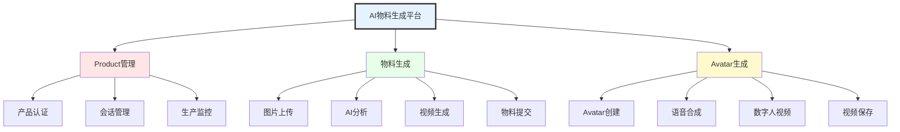

## 一、Product管理业务流程

### 1.1 产品管理主流程

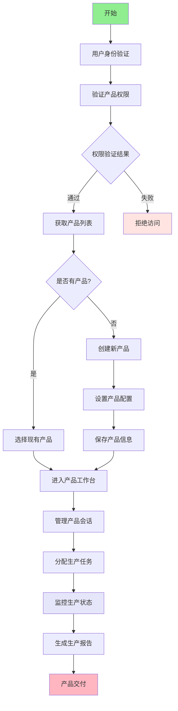

### 1.2 产品会话管理详细流程

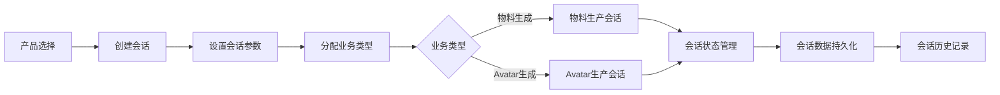

## 二、物料生成业务流程

### 2.1 物料生成完整流程

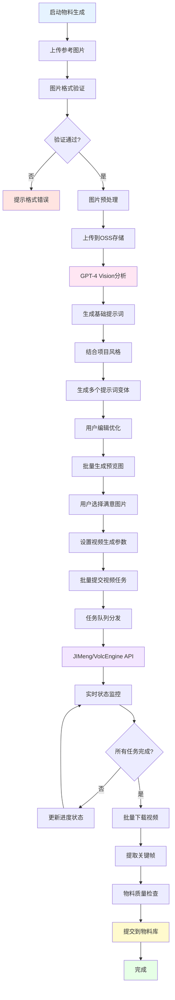

### 2.2 AI提示词生成子流程

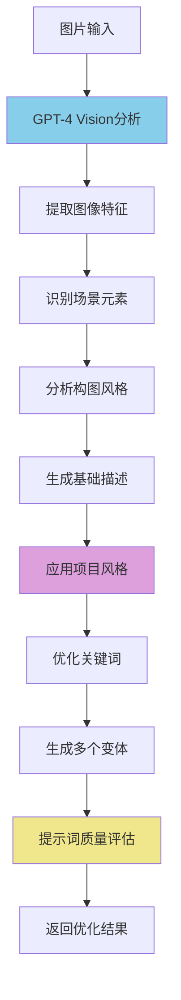

### 2.3 视频生成任务管理

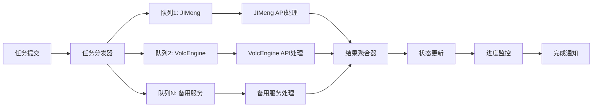

## 三、Avatar生成业务流程

### 3.1 Avatar生成完整流程

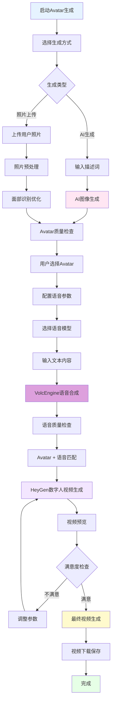

### 3.2 语音合成子流程

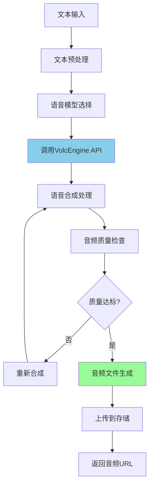

### 3.3 数字人视频生成子流程

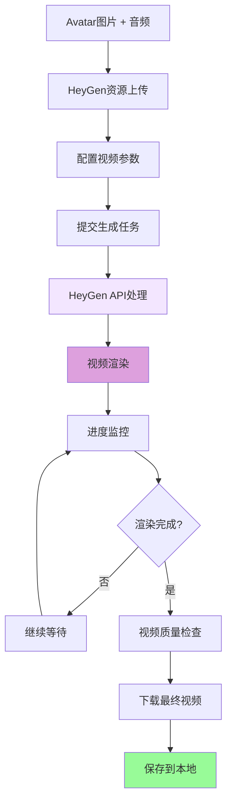

## 四、业务流程整合架构

### 4.1 统一调度架构

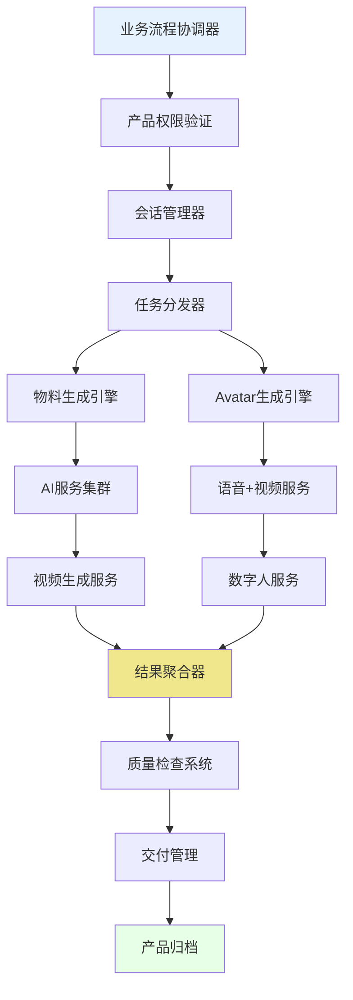

### 4.2 数据流转时序图

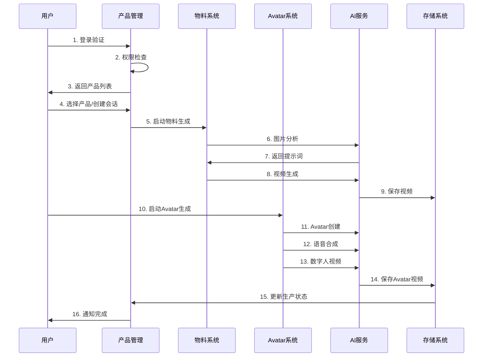

## 五、性能监控与质量保证

### 5.1 实时监控架构

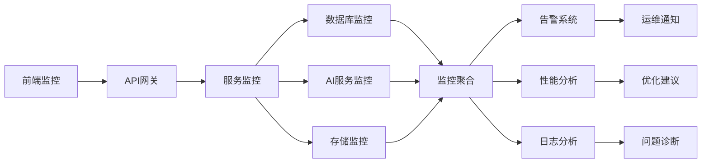

### 5.2 质量保证流程

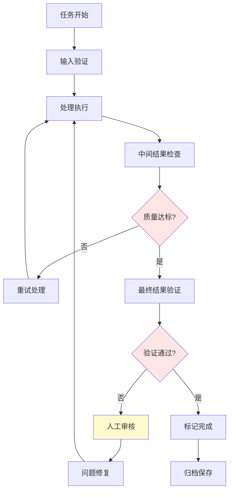

## 六、关键性能指标

### 6.1 业务性能指标

| 业务流程 | 成功率目标 | 平均处理时间 | 并发能力 |
|---------|-----------|-------------|----------|
| Product管理 | >99% | <2秒 | 1000用户 |
| 物料生成 | >90% | 3-5分钟 | 50任务 |
| Avatar生成 | >85% | 5-10分钟 | 20任务 |

### 6.2 技术性能指标

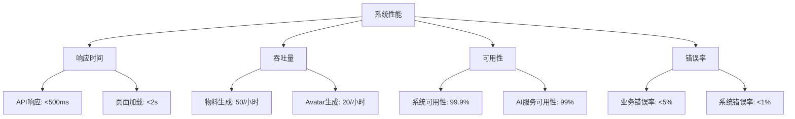

## 七、总结

本AI物料生成平台通过三条核心业务流程的深度整合，实现了：

1. **统一的产品管理**: 完整的产品生命周期管控
2. **高效的物料生产**: AI驱动的自动化视频生成
3. **创新的Avatar制作**: 数字人技术的商业化应用

平台具备高性能、高可用、强扩展的技术特性，能够支撑大规模数字内容生产需求。 